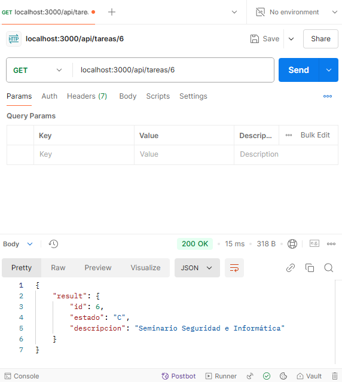

# Prueba Técnica - API RESTful con Express

## Objetivo de la Prueba Técnica

Desarrollar una **API RESTful** en **Express** para gestionar información de **Usuarios** y **Tareas** en una estructura modular. Debes implementar endpoints para crear, actualizar, listar y eliminar registros de ambas entidades.

## Requisitos

- **Lenguaje**: Node.js (Express)
- **Base de Datos**: MySQL
- **Estructura Modular**: Organizar el proyecto de forma modular para cada entidad (Usuarios y Tareas).
- **Conexión a MySQL**: Realizar consultas SQL directamente sin un ORM (Object-Relational Mapping).
- **Manejo de Errores y Respuestas**: Implementar un adecuado manejo de errores y respuestas en la API.

## Funcionalidades

1. **Usuarios**
   - Crear un usuario.
   - Listar usuarios.
   - Listar un usuario.
   - Actualizar datos de un usuario.
   - Eliminar un usuario.

2. **Tareas**
   - Crear una tarea.
   - Listar tareas.
   - Listar una tarea.
   - Actualizar una tarea.
   - Eliminar una tarea.

## Estructura del Proyecto

El proyecto debe estar organizado de forma modular para separar claramente las rutas, controladores y modelos correspondientes a cada entidad (Usuarios y Tareas). Una posible estructura del proyecto podría ser la siguiente:

## Capturas de Pantalla del proyecto
- Método POST
   

   
- Método GET
   - Listar tabla
     
   

   
   - Listar un registro

   

   
- Método PUT
   

   
- Método Delete
   

